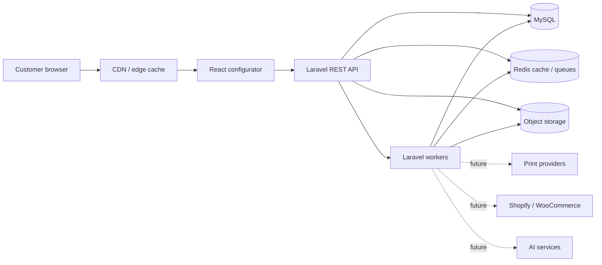
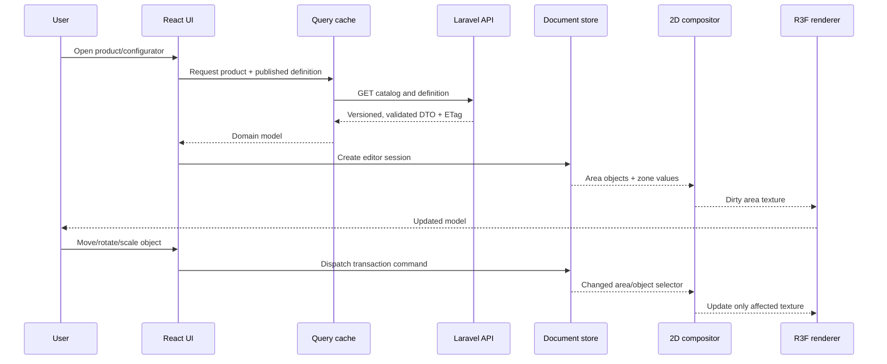
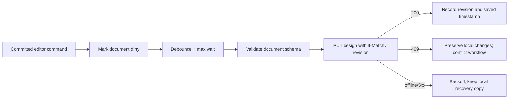
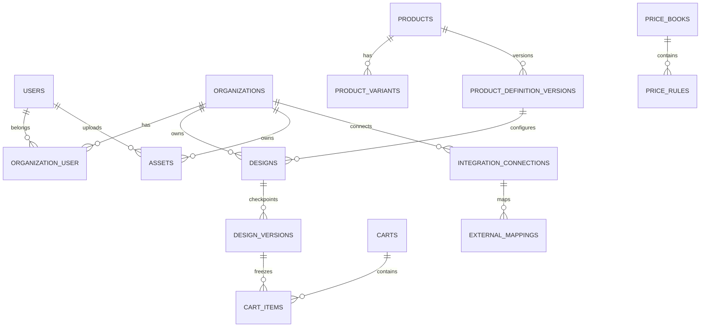
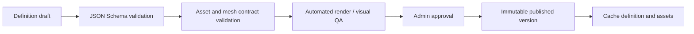
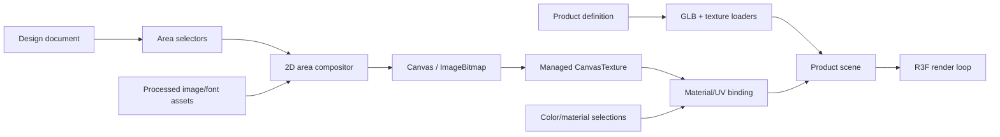

# 3D Product Configurator — Architecture Blueprint

Status: **Accepted for Module 1**  
Last updated: 2026-07-14  
Scope: architecture and contracts only; no feature implementation

## 1. Executive summary

The application is a multi-tenant SaaS product configurator built as a **modular monolith**. Laravel owns identity, tenancy, catalog, pricing, designs, carts, orders, assets, integrations, and asynchronous work. React owns the interactive editing session. A typed REST contract is the only boundary between them.

The configurator is product-agnostic. It does not contain `if product === "shirt"` rules. A published, immutable product-definition version tells the frontend which model to load, which material and color zones exist, which print areas are available, what camera presets to use, and which capabilities or restrictions apply.

The design document is also versioned and product-independent. It stores normalized objects in print-area coordinates, not Three.js objects, DOM nodes, or canvas pixels. The same document can therefore drive the editor, preview rendering, production export, cart snapshots, and future integrations.

### Quality targets

| Concern | Initial target |
|---|---|
| Viewer performance | 60 FPS on supported desktop; graceful 30+ FPS mobile fallback |
| Interaction latency | under 50 ms for direct manipulation; under 100 ms perceived UI response |
| Initial editor route | under 250 KB gzip application JS, excluding lazy 3D/editor chunks |
| Model budget | configurable by device tier; baseline 5–15 MB compressed GLB |
| Texture budget | 2K desktop, 1K mobile by default; KTX2 where compatible |
| API availability | 99.9% after production hardening |
| Draft durability | acknowledged saves are durable; autosave is retryable and idempotent |
| Tenant isolation | enforced in policies/query scopes and covered by tests |
| Accessibility | WCAG 2.2 AA for non-canvas workflows and equivalent editor actions |

## 2. Architectural style

### 2.1 System context



Deploy the web/API process and queue workers independently, even though they share one Laravel codebase. This preserves simple transactions now while allowing heavy export, thumbnail, model-processing, and integration workloads to scale separately.

### 2.2 Backend modules

Each domain owns its models, policies, actions, data objects, events, jobs, and tests. Cross-module calls go through explicit application services or events—not direct controller-to-model orchestration.

| Module | Owns | Does not own |
|---|---|---|
| Identity | authentication, users, roles, permissions | tenant catalog data |
| Tenancy | organizations, membership, tenant resolution | authentication credentials |
| Catalog | products, variants, categories, product-definition versions | live editing state |
| Assets | upload sessions, metadata, virus checks, derived files, fonts | object placement |
| Designs | design documents, versions, shares, autosave concurrency | product pricing |
| Pricing | price books, tiers, quotes, tax inputs | cart persistence |
| Cart | carts, items, frozen design/price references | provider fulfillment |
| Orders | checkout handoff, order snapshots, status | editor behavior |
| Exports | production PDFs/renders/print packages | HTTP request lifecycle |
| Integrations | provider connections, mappings, webhooks, outbox | core catalog rules |
| Admin | publishing workflows, validation reports | public editor state |

Start with one database. A module may be extracted only after measured scaling or organizational pressure; its contracts already provide seams for doing so.

### 2.3 Frontend layers

Dependencies point inward and downward:

```text
app/routes/pages
    -> features (user capabilities)
        -> entities (product, design, asset, cart)
            -> shared (UI, API, i18n, utilities)

features/configurator
    -> editor-core (product-independent commands and document model)
    -> rendering-3d (R3F adapters and resource lifecycle)
    -> rendering-2d (print-area canvas adapters)
```

React components render and bind events. They do not contain pricing rules, mutate Three.js resources directly, call Axios directly, or know database shapes.

## 3. Repository structure

The first implementation module should migrate incrementally toward this structure. Existing Shopify classes remain isolated under `Integrations/Shopify` until replaced; they must not define the core `Product` model.

```text
3DShirt/
├── app/
│   ├── Domains/
│   │   ├── Identity/
│   │   ├── Tenancy/
│   │   ├── Catalog/
│   │   │   ├── Actions/
│   │   │   ├── Contracts/
│   │   │   ├── Data/
│   │   │   ├── Events/
│   │   │   ├── Models/
│   │   │   ├── Policies/
│   │   │   └── Services/
│   │   ├── Assets/
│   │   ├── Designs/
│   │   ├── Pricing/
│   │   ├── Cart/
│   │   ├── Orders/
│   │   ├── Exports/
│   │   └── Integrations/
│   │       ├── Shopify/
│   │       ├── WooCommerce/
│   │       └── PrintProviders/
│   ├── Http/
│   │   ├── Controllers/Api/V1/
│   │   ├── Middleware/
│   │   ├── Requests/Api/V1/
│   │   └── Resources/Api/V1/
│   ├── Jobs/
│   ├── Providers/
│   └── Support/
├── database/
│   ├── factories/
│   ├── migrations/
│   └── seeders/
├── resources/
│   ├── js/
│   │   ├── app/
│   │   │   ├── App.tsx
│   │   │   ├── providers/
│   │   │   ├── routes/
│   │   │   └── styles/
│   │   ├── pages/
│   │   ├── features/
│   │   │   ├── configurator/
│   │   │   ├── asset-library/
│   │   │   ├── product-selector/
│   │   │   ├── draft-management/
│   │   │   ├── cart/
│   │   │   └── auth/
│   │   ├── entities/
│   │   │   ├── product/
│   │   │   ├── design/
│   │   │   ├── asset/
│   │   │   └── cart/
│   │   ├── editor-core/
│   │   │   ├── commands/
│   │   │   ├── document/
│   │   │   ├── geometry/
│   │   │   ├── history/
│   │   │   ├── selection/
│   │   │   └── snapping/
│   │   ├── rendering-2d/
│   │   │   ├── adapters/
│   │   │   ├── canvas/
│   │   │   ├── compositing/
│   │   │   └── workers/
│   │   ├── rendering-3d/
│   │   │   ├── cameras/
│   │   │   ├── components/
│   │   │   ├── loaders/
│   │   │   ├── materials/
│   │   │   ├── performance/
│   │   │   └── textures/
│   │   ├── stores/
│   │   ├── services/
│   │   ├── hooks/
│   │   ├── shared/
│   │   │   ├── api/
│   │   │   ├── i18n/
│   │   │   ├── ui/
│   │   │   ├── utils/
│   │   │   └── validation/
│   │   └── types/
│   ├── css/
│   └── views/
├── routes/
│   ├── api.php
│   └── web.php
├── docs/
│   ├── architecture/
│   ├── schemas/
│   └── roadmap.md
└── tests/
    ├── Feature/
    ├── Unit/
    └── Architecture/
```

Keep public frontend barrels narrow. A feature exports its public component, hooks, and types from `index.ts`; consumers do not import its internals.

## 4. Component tree

```text
App
├── ErrorBoundary
├── QueryProvider
├── AuthProvider
├── ThemeProvider
├── I18nProvider
└── RouterProvider
    ├── PublicLayout
    │   ├── CatalogPage
    │   └── SharedDesignPage
    ├── AccountLayout
    │   ├── DraftsPage
    │   └── OrdersPage
    ├── AdminLayout
    │   ├── ProductsPage
    │   └── ProductDefinitionEditorPage
    └── ConfiguratorPage
        └── ConfiguratorShell
            ├── TopBar
            │   ├── ProductBreadcrumb
            │   ├── HistoryControls
            │   ├── SaveStatus
            │   └── ViewActions
            ├── ToolRail
            │   └── ToolButton[]
            ├── ContextPanel
            │   ├── ProductPanel
            │   ├── AreaPanel
            │   ├── AddObjectPanel
            │   ├── TextPropertiesPanel
            │   ├── ImagePropertiesPanel
            │   ├── ColorZonePanel
            │   ├── MaterialPanel
            │   └── LayersPanel
            ├── Workspace
            │   ├── ViewerBoundary
            │   │   └── ProductSceneCanvas
            │   │       ├── AdaptiveCamera
            │   │       ├── EnvironmentRig
            │   │       ├── ProductModel
            │   │       ├── DynamicMaterial[]
            │   │       ├── ContactShadows
            │   │       └── PerformanceGovernor
            │   ├── PrintAreaEditorOverlay
            │   │   ├── PrintBoundary
            │   │   ├── ObjectRenderer[]
            │   │   ├── SelectionBox
            │   │   ├── TransformHandles
            │   │   └── AlignmentGuides
            │   └── ViewportControls
            ├── AreaSwitcher
            ├── ZoomControls
            ├── PriceSummary
            ├── MobileBottomSheet
            └── AddToCartAction
```

The 2D editor may be presented as an overlay or a focused flat-area view. It is not rendered inside the R3F scene. Both views consume the same document state.

## 5. State management

Use three kinds of state and do not mix them.

### 5.1 Server state

TanStack Query is recommended for products, definitions, assets, drafts, quotes, and carts. It owns request deduplication, loading/error states, cache lifetime, and mutation invalidation. API DTOs are validated at the boundary and mapped to domain types.

### 5.2 Editor document state

A vanilla Zustand store is created per configurator instance and exposed through React context. It contains serializable design data only:

```text
documentStore
├── metadata: design/product/version/schema/revision
├── product: selected variant, size, quantity
├── zonesById: selected values
├── areasById
│   ├── orderedObjectIds
│   └── optional area settings
├── objectsById: normalized design objects
├── groupsById
└── variables: roster names/numbers and future template variables
```

All edits enter through commands such as `object.add`, `object.transform`, `objects.align`, `group.create`, and `zone.setColor`. Commands validate invariants, produce Immer-style patches/inverse patches, and are grouped into transactions for pointer drags and text typing. This gives deterministic undo/redo without snapshotting canvases.

History is session-local and capped by memory budget. Durable `design_versions` are separate checkpoints created by explicit save, debounced autosave, add-to-cart, and export.

### 5.3 Ephemeral UI/runtime state

A separate Zustand UI store owns active tool, selection, hover, open panels, viewport mode, camera preset, guides, transient drag state, and save status. Non-serializable Three.js, Canvas, DOM, loader, and worker references stay in adapter-owned refs/registries—not in Zustand and never in a design JSON document.

### 5.4 Store rules

- Selectors must be narrow and use shallow equality where appropriate.
- Actions are named domain operations; components never call raw `set`.
- Expensive derived values use memoized selectors.
- One pointer gesture produces one undo entry.
- Remote save uses optimistic concurrency with `revision`/ETag.
- Receiving `409 Conflict` never silently overwrites another revision.
- URL state owns share IDs, product slug, locale, and optionally active area—not design content.

## 6. Data flow

### 6.1 Load and edit



### 6.2 Autosave



Local recovery in IndexedDB is an availability aid, not the authoritative draft. Assets must be uploaded before a durable design version references them.

## 7. API architecture

Base path: `/api/v1`. Use JSON, ISO-8601 UTC timestamps, stable string error codes, ULID public identifiers, cursor pagination for large collections, and an `Idempotency-Key` header for retried commands that create resources.

### 7.1 Endpoint groups

| Method and path | Purpose |
|---|---|
| `GET /catalog/products` | Filtered, localized product catalog |
| `GET /catalog/products/{slug}` | Product summary and available variants |
| `GET /product-definitions/{id}` | Immutable definition version; CDN-cacheable |
| `POST /assets/upload-sessions` | Signed direct-upload session |
| `POST /assets/{id}/complete` | Verify upload and dispatch processing |
| `GET /assets` | Tenant/user asset library |
| `POST /designs` | Create a draft against an exact definition version |
| `GET /designs/{id}` | Load current draft or shared design |
| `PUT /designs/{id}` | Idempotent autosave with optimistic concurrency |
| `POST /designs/{id}/versions` | Explicit immutable checkpoint |
| `GET /designs/{id}/versions` | Design history |
| `POST /designs/{id}/share-links` | Revocable scoped share link |
| `POST /quotes` | Authoritative price for product/design/quantity |
| `GET /carts/current` | Active cart |
| `POST /carts/current/items` | Add frozen design version and quote |
| `POST /exports` | Queue preview/production export |
| `GET /exports/{id}` | Poll job status and signed artifact links |
| `GET /me` | Authenticated identity and tenant capabilities |
| `GET /locales/{locale}` | Optional runtime translations/content |

Admin endpoints use `/api/v1/admin/*` for product drafts, definition validation, publishing, price books, and asset approval. Integration webhooks use provider-specific signed routes and are never authenticated as browser API calls.

### 7.2 Response and error envelopes

Successful single-resource responses use `{"data": {...}, "meta": {...}}`. Validation and domain failures use RFC 9457-style problem details:

```json
{
  "type": "https://example.test/problems/revision-conflict",
  "title": "Design revision conflict",
  "status": 409,
  "code": "DESIGN_REVISION_CONFLICT",
  "detail": "The draft changed after revision 17.",
  "instance": "/api/v1/designs/01J...",
  "errors": {}
}
```

### 7.3 Security rules

- Use Sanctum cookie authentication for the first-party SPA with CSRF enabled; personal access tokens are reserved for controlled integrations.
- Resolve the organization once per request and enforce access through policies plus tenant-aware repositories/query objects.
- Rate-limit auth, uploads, exports, sharing, quotes, and webhook endpoints independently.
- Use signed short-lived object-storage URLs. Never expose storage keys as authorization.
- Validate MIME from file contents, scan uploads, sanitize SVG, rasterize untrusted SVG for preview, and reject active content.
- Store secrets encrypted; redact tokens and document payloads from logs.
- Require authorization again inside queued jobs because queue delay can outlive access changes.
- Add CSP, secure cookies, HSTS in production, audit logs, webhook signature verification, and idempotent webhook ingestion.

**Current-boilerplate blockers:** `bootstrap/app.php` does not register `routes/api.php`, globally excludes every route from CSRF validation, and the existing product tables are Shopify-shaped (including `varients` spelling) rather than core catalog models. These must be corrected in the foundation module, with migration/backfill rather than destructive changes to live data.

## 8. Database schema

Use MySQL `utf8mb4`, UTC timestamps, foreign keys, decimal money in minor units plus ISO currency, and ULIDs for public aggregate identifiers. JSON stores versioned documents/configuration; columns store fields used for filtering, authorization, joins, ordering, and uniqueness.



### 8.1 Core tables

| Table | Important fields and indexes |
|---|---|
| `organizations` | `id`, `name`, `slug UNIQUE`, `status`, settings JSON |
| `organization_user` | org/user FKs, role, `UNIQUE(org_id,user_id)` |
| `products` | `id`, optional owner org, slug, type, status, default definition ID; indexes on tenant/status/type |
| `product_variants` | product FK, SKU, option values JSON, status; unique tenant-aware SKU |
| `product_definition_versions` | product FK, integer version, schema version, definition JSON, checksum, status, published timestamp; unique product/version |
| `price_books` | tenant/market/currency/effective range/status |
| `price_rules` | price book/product/variant, quantity bounds, amount minor, setup/print rules JSON |
| `assets` | owner/tenant, kind, storage disk/key, original name, detected MIME, bytes, checksum, dimensions, status, metadata JSON |
| `asset_variants` | asset FK, purpose, storage key, MIME, dimensions, bytes |
| `fonts` | tenant/global scope, family/style/weight, asset FK, license metadata, status |
| `designs` | owner/tenant, product and definition-version FKs, title, status, current revision, current document JSON, timestamps |
| `design_versions` | design FK, revision, immutable document JSON, checksum, reason, creator; unique design/revision |
| `design_share_links` | design/version, hashed token, permission, expiry, revoked timestamp |
| `carts` | owner/session/tenant, currency, status, expiry |
| `cart_items` | cart, variant, frozen design-version, quantity, unit/total minor, quote snapshot JSON |
| `exports` | design version, type, status, progress, options JSON, artifact asset, error code |
| `integration_connections` | tenant, provider, encrypted credentials, scopes, status |
| `external_mappings` | connection, local type/id, external type/id; composite unique keys |
| `webhook_receipts` | provider event ID unique, payload checksum, status, attempts |
| `outbox_messages` | event type, aggregate, payload, available/processed timestamps |
| `audit_logs` | actor/tenant, action, subject, safe metadata, timestamp |

Keep the full current document on `designs` for fast editor load and immutable snapshots in `design_versions`. Do not write a database row for every pointer movement or design object. Large production artifacts live in object storage, never MySQL blobs.

## 9. Product-definition architecture

The authoritative JSON Schema is [product-definition.schema.json](../schemas/product-definition.schema.json). Each published version is immutable and content-addressed by checksum.

### 9.1 Required concepts

- **Model:** GLB asset, units, orientation, optional Draco/Meshopt use, mesh contracts, LODs.
- **Color zone:** semantic zone ID mapped to one or more material slots or shader inputs.
- **Material preset:** PBR values and texture assets with allowed overrides.
- **Print area:** physical dimensions, editor coordinate system, DPI/export requirements, boundary/safe/bleed paths, mesh binding and UV transform.
- **Camera preset:** named position/target and optional area association.
- **Capabilities:** tools enabled for this product/area.
- **Restrictions:** object count, upload types/size, scale limits, coverage, palette, production rules.
- **Variants/pricing references:** stable IDs only; the server remains price authority.

Print paths use normalized SVG path data in the area's physical coordinate system. Never encode arbitrary JavaScript, shader source, or URLs supplied by tenants in a definition.

### 9.2 Publishing workflow



Publishing fails if a mesh/material/UV binding is absent, referenced assets are not ready, paths exceed boundaries, duplicate IDs exist, or schema/semantic validation fails. Existing designs retain their old definition version.

## 10. Design-document architecture

The authoritative JSON Schema is [design-document.schema.json](../schemas/design-document.schema.json).

Coordinates use millimetres in a top-left-origin area plane. Transforms are explicit (`x`, `y`, `rotationDeg`, `scaleX`, `scaleY`) and independent of viewport pixels. Rendering adapters convert area coordinates to Canvas and UV space.

All object kinds share identity, area, visibility, opacity, lock state, transform, bounds, z-order through the area's ordered ID list, and optional group membership. Kind-specific payloads hold text, image, SVG, QR/barcode, or shape properties. Names and numbers are text objects with variable bindings rather than special renderer types.

References use asset IDs and immutable asset-variant IDs, never expiring signed URLs. Gradients, shadows, outlines, masks, crop settings, and text-path effects are declarative. Unsupported future effects are rejected by capability validation instead of being silently discarded.

## 11. Rendering pipeline



### 11.1 Runtime sequence

1. Fetch and validate the immutable product definition.
2. Load the lowest useful LOD and critical material textures; progressively upgrade.
3. Load or initialize the serializable design document.
4. Create one compositor per active/visible print area lazily.
5. Re-render only a dirty area after a document change; throttle during gestures and render full quality after commit.
6. Update an existing managed texture rather than replacing materials on every edit.
7. Apply color zones through stable material instances or uniforms.
8. Invalidate the R3F frame on relevant changes (`frameloop="demand"`), except while interacting/animating.
9. Export from the document at production resolution in a worker/server job, never by screenshotting the viewport.

### 11.2 Adapter contracts

The editor core depends on interfaces such as `AreaCompositor`, `AssetResolver`, `TextLayoutEngine`, and `ProductRenderer`; it does not import R3F or a canvas library. This permits replacing the 2D implementation and running deterministic export services.

Every loader returns an owned resource handle with `release()`. The resource registry reference-counts geometries, materials, textures, HDRIs, and object URLs. Route/product changes abort in-flight loads, unregister event listeners, terminate workers, revoke object URLs, and dispose only resources owned by that session.

### 11.3 Multiple print-area strategies

- Prefer dedicated UV regions/material maps when the model supports them.
- Use a texture atlas when many areas share one material and atlas padding prevents bleeding.
- Use decals only for products/areas whose production mapping matches decal projection.
- Keep physical print/export coordinates separate from model UV coordinates through a definition-provided affine transform or mesh binding.

## 12. Performance strategy

### 12.1 Asset pipeline

- Enforce GLB mesh/material naming contracts in CI/admin validation.
- Draco or Meshopt-compress geometry; use KTX2/Basis textures with PNG/JPEG/WebP fallback where needed.
- Generate model LODs, texture tiers, thumbnails, and environment-map derivatives asynchronously.
- Strip unused nodes, animations, cameras, and texture channels.
- Use texture atlases only when they reduce draw calls without harming update locality.
- Cache immutable assets with hashed URLs and long-lived headers.

### 12.2 Runtime budgets and adaptation

Classify the device using measured frame time, DPR, memory hints, and GPU capability—not user agent alone. The performance governor may adjust DPR, shadow resolution, antialiasing, post-processing, model LOD, texture tier, environment resolution, and update frequency. It must never alter production output quality.

Use `React.lazy` at route and major tool-panel boundaries. Defer fonts, icon libraries, HDRI, high LODs, and 2D editor engines. Preload only the next probable product/area under an explicit byte budget.

Avoid React state changes on every animation frame. Use refs for transient rendering values, selectors for store subscriptions, instancing for repeated meshes, BVH/raycast optimization where measured, and workers/OffscreenCanvas for expensive compositing when supported.

### 12.3 Measurement gates

- Automated bundle budgets and dependency-size reports in CI.
- Representative low/mid/high device profiles and models.
- Frame-time p50/p95, draw calls, triangles, texture memory, editor command latency, long tasks, model load, and first useful render.
- Leak test: switch products/areas repeatedly and assert stabilized heap/GPU resources.
- Visual regression renders for known product/design fixtures.

## 13. UI and design system

Build a small token-driven system rather than mixing Tailwind utilities with MUI/Polaris styling. Shopify Polaris is restricted to the future Shopify administration surface.

Tokens cover neutral/accent/semantic colors, spacing, radius, typography, elevation, motion, z-index, control size, focus ring, and canvas overlays. CSS variables provide light/dark themes; Tailwind consumes the variables. Components are accessible primitives with variants, not page-specific visual copies.

Desktop uses a tool rail, contextual inspector, central canvas, and compact top bar. Mobile uses the full viewport for the product, a bottom tool bar, bottom sheets, larger touch targets, gesture arbitration, and safe-area insets. All canvas actions must have keyboard/button alternatives; focus must not be trapped by WebGL.

Internationalization is key-based from the start. Product marketing content is localized server data. UI messages are frontend translation bundles. Use `Intl` for pluralization, numbers, currencies, and dates; support RTL layout without mirroring design coordinates.

## 14. Reliability, operations, and testing

### 14.1 Queue lanes

Use separate queues and worker policies:

- `critical`: order/integration state transitions
- `default`: ordinary domain events
- `media`: virus scan and image/model derivatives
- `exports`: production and preview renders
- `webhooks`: provider ingestion
- `low`: cleanup and analytics

Jobs are idempotent, carry tenant/actor context, define retry/backoff/timeout, and record a safe failure reason. Transactional outbox messages are committed with domain changes and dispatched after commit.

### 14.2 Test pyramid

- Unit: commands, transforms, snapping, schema semantics, pricing rules.
- Contract: JSON Schema fixtures, generated TypeScript/PHP DTO compatibility, API problem shapes.
- Feature: auth/tenancy policies, version conflicts, publishing, cart snapshots, signed uploads, webhooks.
- Component: panels and editor actions with accessibility assertions.
- Integration: 2D compositor and 3D binding using fixed assets.
- End-to-end: product selection → edit → undo → save → reload → quote → cart.
- Visual: deterministic camera/HDRI fixtures across representative product classes.
- Performance: budgets and repeated mount/unmount leak scenarios.

Observability includes structured logs with request/tenant/job correlation IDs, metrics, traces across API/queue/storage, frontend error reporting, Web Vitals, queue depth/age, export duration, autosave failure rate, and webhook lag. Do not put raw design documents or credentials in telemetry.

## 15. Architecture guardrails

1. A published definition or design version is immutable.
2. Orders and cart items point to frozen design and quote snapshots.
3. Pricing is always authoritative on the server.
4. The client never branches on product slug/type to implement product behavior.
5. Editor documents contain only serializable, schema-valid domain data.
6. Controllers translate HTTP and call one application action; business logic lives elsewhere.
7. External providers map to core entities and never become core entities.
8. Heavy media/export/integration work never runs in an HTTP request.
9. All tenant-owned queries and jobs prove tenant context.
10. New dependencies require a bundle/security/license justification.

## 16. Decisions deferred to implementation modules

- Exact 2D canvas engine after a focused spike comparing text fidelity, SVG support, object controls, serialization, worker support, and maintenance health.
- Client/server production-render technology after fidelity testing.
- S3-compatible production provider and CDN.
- Redis/Horizon deployment topology.
- Billing provider and subscription/entitlement model.
- Real-time collaborative editing; the current revision model is compatible but collaboration is not an MVP assumption.

These deferrals do not change the schemas or module boundaries in this blueprint.

